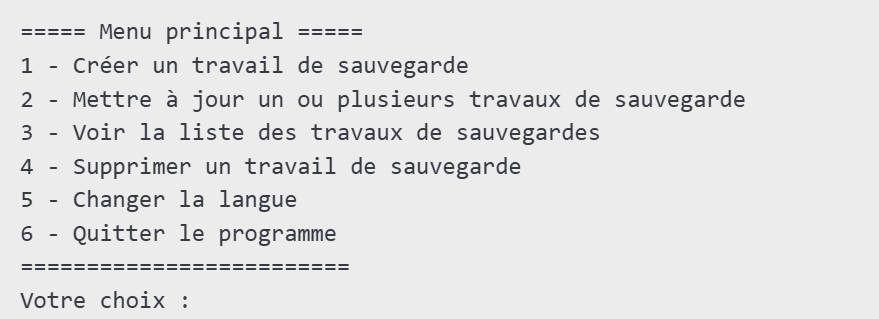
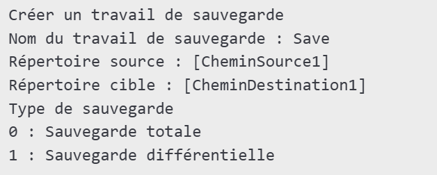
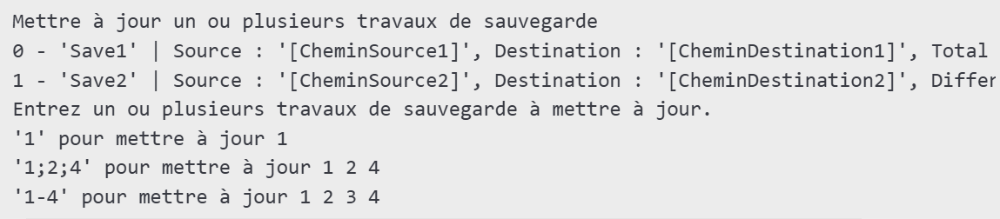
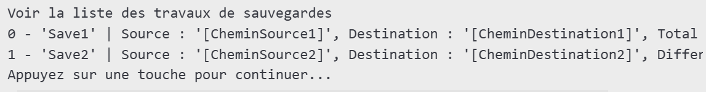
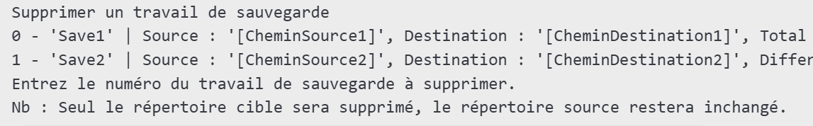

# Manuel Utilisateur - EasySave

## Introduction

EasySave est une application permettant d'effectuer des sauvegardes de fichiers et de dossiers de manière simple et efficace. Ce manuel vous guidera dans l'utilisation de l'application, de l'installation à la gestion de vos sauvegardes.

## Installation

### Prérequis

- Windows 10 ou supérieur
- .NET 8.0 ou version compatible
- Espace disque suffisant pour stocker les sauvegardes

### Étapes d'installation

1. Cloner le repos GitHub
2. Exécutez le programme en lançant la commande 'dotnet run' depuis `<RACINE_DU_REPO>\EasySave\Easysave`

## Utilisation

### Lancement de l'application

Lancez `EasySave.exe` depuis votre répertoire d'installation. Une interface en ligne de commande s'affichera avec le menu principal :

### Création d'une sauvegarde

1. Sur l'interface graphqiue
2. Remplissez les informations demandées :
   - **Nom du travail de sauvegarde** : entrez un nom pour identifier la sauvegarde.
   - **Répertoire source** : indiquez le chemin absolu du dossier ou des fichiers à sauvegarder.
   - **Répertoire cible** : indiquez le chemin absolu où la sauvegarde sera stockée.
   - **Type de sauvegarde** :
     - `0` pour une sauvegarde complète (copie tous les fichiers).
     - `1` pour une sauvegarde différentielle (copie uniquement les fichiers modifiés).

Exemple d'interface :

### Exécution d'une sauvegarde

1. Sélectionnez **2 - Mettre à jour un ou plusieurs travaux de sauvegarde**.
2. Une liste des sauvegardes disponibles s'affiche, par exemple :

3. Entrez les numéros correspondant aux sauvegardes à exécuter.
4. L'application effectue les copies selon le type défini.

### Consultation des sauvegardes existantes

1. Sélectionnez **3 - Voir la liste des travaux de sauvegardes**.
2. Une liste des sauvegardes existantes s'affiche avec leurs détails, par exemple :

### Suppression d'une sauvegarde

1. Sélectionnez **4 - Supprimer un travail de sauvegarde**.
2. Une liste des sauvegardes s'affiche, par exemple :

3. Entrez le numéro correspondant à la sauvegarde à supprimer.
4. Confirmez la suppression.

### Modification de la langue

1. Sélectionnez **5 - Changer la langue** dans le menu principal.
2. Choisissez une langue parmi celles disponibles dans la liste affichée.

## Gestion des fichiers journaux et états

- Les fichiers journaux (logs) et états sont stockés dans :
  - `[CheminUtilisateur]\AppData\Roaming\EasySave\Logs` pour les fichiers logs.
  - `[CheminUtilisateur]\AppData\Roaming\EasySave\state.json` pour l'état des sauvegardes.

## Support et Assistance

- Consultez la documentation fournie.
- Vérifiez les fichiers logs en cas de problème.
- Contactez l'équipe de support via le site officiel.

## Conclusion

EasySave simplifie la gestion des sauvegardes en automatisant le processus et en offrant une interface intuitive. Grâce à ses options avancées, il répond aux besoins des utilisateurs souhaitant protéger leurs données efficacement.
